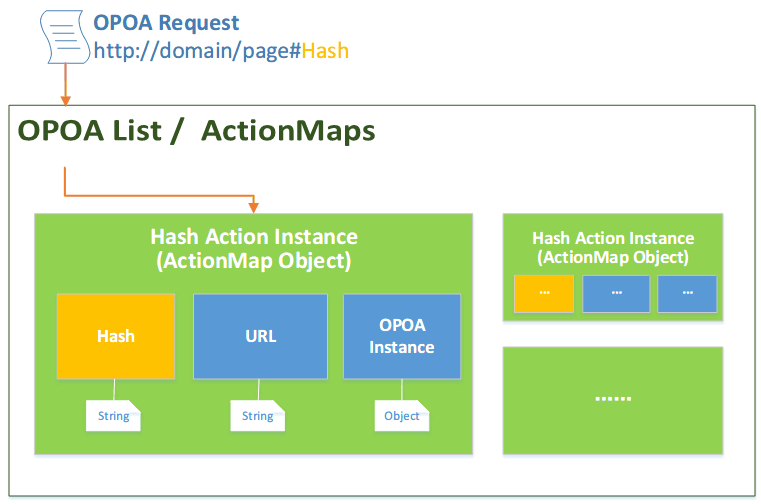
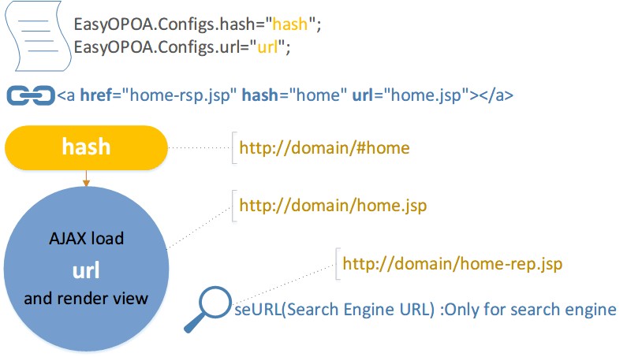

#EasyOPOA 框架使用手册

Please enter [OPOA](https://github.com/ushelp/OPOA/) in English Version.

EasyOPOA是一个进行OPOA程序开发的框架，为OPOA程序开发定义出了一套完整的标准概念和规范。仅需几步简单的配置即能够快速、灵活的开发出优质的OPOA程序。


> OPOA(One Page，One Application)，又叫Single Page Application，是目前流行的在单个页面利用Ajax来完成所有请求处理的设计和开发方式。拥有加载速度快、节省流量、高效、利于设计等诸多优点。
> 
> OPOA开发的核心是Ajax，由于Ajax本身对于地址不更新的特点。开发OPOA程序还要考虑到动作定位和前进后退两大问题。动作定位主要通过location.hash完成，前进后退需要History API的协助。
> 除了客户的体验之外，对搜索引擎的友好也相当重要，由于现有的搜索引擎技术并不会从Ajax中加载内容，不同hash锚记的内容会被忽略，所以采取了OPOA设计的Web程序，由于只有一个页面，搜索引擎根本无法爬取到Ajax加载的信息内容，无法收录，不利于SEO，影响了OPOA的实用性。
> 
>这些不同传统客户体验的问题，既影响了用户对OPOA程序更好的使用感受，也影响了OPOA的实用性。


### EasyOPOA 开发框架主要特点：

1. 支持动作定位，解决了OPOA程序的动作定位问题，能够实现存书签存储，使用户可以收藏分享链接。能够在同一个URL下通过不同hash动作加载不同请求。

2. 支持浏览器前进后退，解决OPOA程序利用浏览器前进后退问题（需要HTML5支持，低版本浏览器采取hash兼容策略，使用者完全透明化）。

3. 支持搜索引擎对OPOA程序的内容抓取和收录，解决了OPOA程序的在搜索引擎中无法抓取的难点。结合RSP（Rich Server Page，富服务器端页面设计/胖服务器端设计，与传统OPOA的瘦服务器端设计对应）设计可提供更友好的SEO优化方案。

4. 支持在One Page页面多个不同区域实现OPOA，可以在一个页面的不同区域使用多个独立OPOA程序。

5. 支持在动作中使用数据参数（路由配置），让动作匹配更加灵活，在客户端实现RESTful风格的高级动作自定义。

6. 支持动作记忆功能，能够记录最后访问的动作，实现OPOA动作恢复。

7. 支持AMD规范 

8. 同时兼容各种浏览器（Trident、Gecko、Webkit、Presto），支持多系统和平台应用（PC，TabletPC，Mobile）。


使用框架编程有助于将公共问题统一解决，在大项目时能构建更加**有序、统一、标准**的项目；在框架一定的基础之上进行开发，能将开发**精力更多集中在具体业务**上。也对程序日后的**拓展和维护**有很大帮助。

EasyOPOA 框架让OPOA程序的具体内部结构对开发和使用者完全透明，同时它既满足了客户对传统Web应用的使用感受的需要，又能将开发人员从繁琐混乱没有标准的的OPOA程序抽离，带来良好的使用体验，同时兼顾对搜索引擎的友好。

EasyOPOA 秉承了作者始终坚持的“**More Easy, More Powerful.**”追求理念：轻量，简单，灵活，全面。在提供强大全面功能的前提下并未限制使用者在开发上的灵活性。


### [官网主页](http://www.lightfeel.com/easy/easyopoa/zh-cn/index.jsp 'EasyOPOA官网主页')


----------


## 1、EasyOPOA 框架核心介绍


EasyOPOA框架从全局层面深度剖析和全新理解了OPOA程序，为OPOA程序开发定义出了一套完整的标准概念和规范。面对传统OPOA开发，EasyOPOA框架化无序为有序，化分散为集中，化混乱为统一，为OPOA层面的程序开发提供灵活全面的框架层支持。


EasyOPOA框架对传统无序的OPOA程序开发进行了高度抽象，将EasyOPOA中的每一个请求看作一个“**Hash动作实例（Hash Action Instance）**”，并把与请求相关的配置以“**OPOA实例（OPOA Instance）**”的形式封装。




- ### Hash动作实例（Hash Action Instance）：
 
Hash动作实例（Hash Action Instance）是EasyOPOA框架的的核心对象，EasyOPOA中要执行的每一个请求都是一个“**Hash动作实例（Hash Action Instance）**”，每一个Hash动作实例（Hash Action Instance）都由`hash`、`url`、`OPOAInstance`三个相关部分组成：

	{
		hash : [ url, OPOAInstance ]
	};


**`hash`**：Hash动作名称（也叫动作hash），字符串。是EasyOPOA触发Hash动作实例的唯一标识，在EasyOPOA中，所有的请求，都是通过hash来进行触发。

**`url`**：定义动作要加载的URL请求，字符串。

**`OPOAInstance`**：OPOA实例，定义了当动作执行时，加载请求、渲染页面的方式和细节参数。

#### 完成一个Hash动作实例的三个步骤：


1、使用`hash`触发Hash动作实例（hash值会显示在浏览器URL中`#hash`）

	http://domain/home.jsp#hash

2、动作实例后台自动使用Ajax请求`url`

	http://domain/hash

3、根据`opoaInstance`（OPOA实例）加载和渲染

    


- ### OPOA实例（OPOA Instance）：


OPOA实例（OPOA Instance）是Hash动作实例的组成部分之一。描述了动作执行时，对url请求加载和渲染过程中的方式和具体细节。


一个OPOA实例对象包含十一个与Ajax请求和页面渲染相关的属性：`actions`、`show`、`hash`、`url`、`find`、`notfound`、`method`、`prevent`、`actionMaps`、`urlErrors`、`loading`。

opoa实例默认定义：

```JS
var opoa = {
	// jQuery的DOM选择器，让DOM具有动作触发能力，自动创建Hash动作实例
	// 单击（click）该DOM元素时即会触发一个Hash动作实例
	// （可从选择的DOM中获得'Hash动作实例'所需的hash,url）
	// （结合当前opoa实例，自动创建DOM点击时触发的'Hash动作实例'）
	// 例如，通过该参数选择菜单选项，让OPOA程序的菜单选项能够触发Hash动作实例
	"actions" : null,
	// jQuery的DOM选择器，显示从请求的url加载到的内容
	// 将动作请求url返回的结果显示到选择器指定的区域
	"show" : null,
	// 从DOM节点中获取'Hash动作实例'的hash值的DOM属性名称
	// 默认值：hash
	"hash" : "hash",
	// 从DOM节点中获取'Hash动作实例'的url值的DOM属性名称
	// 默认值：hash (url值默认也等同于hash值)
	"url":"hash",
	// 从服务器获得的数据中，利用find指定的jQuery DOM选择器筛选出指定区域的数据
	// 例如，从服务器中返回的数据中仅获取某个DIV中的内容
	"find" : null,
	// 当find参数的选择器，没有从服务器返回的数据中找到内容时，显示的内容
	// 可选值为"empty","all","自定义内容",function
	// "empty" 显示空内容
	// "all" 显示加载到的所有数据
	// "自定义内容" 将自定义内容的内容显示(可使用消息或图片提示用户)
	// function 执行该函数
	// 默认值：empty
	"notfound" : "empty",
	// 对url进行Ajax请求的具体方式 ：post/get
	// post方式会自动将url请求后的参数转换为post参数发送
	// 默认值：post
	"method" : "post",
	// 阻止默认事件动作。如A标签点击时不触发href
	"prevent" : true,
	// 使用actionMaps修改指定hash对应的默认url为其他值
	// Hash动作映射的`opoaInstance`默认即为当前opoa对象this
	"actionMaps" : {
		// "hash":"url"，
		// "demo":"demo.jsp"
	},
	// 当对url的请求从服务器端返回错误代码时，如何处理
	// 一组数值的HTTP代码和函数对象，当响应时调用了相应的代码。
	"urlErrors" : {
		// 如果执行的动作发生404错误时，如何处理
		// 默认：如果发生404加载错误，页面不会有任何响应
		404 : function() {
		},
		// 如果执行的动作发生500错误时，如何处理
		// 默认：如果发生500加载错误，页面不会有任何响应
		500 : function() {
		}
		// 也可定义其他状态
	},
	// 在ajax请求的不同状态时分别调用的函数，可用来进行loading提示
	"loading" : {
		// ajax请求开始
		"start" : function(hash, url, opoa, postData) {
		},
		// ajax请求成功
		"success" : function(hash, url, opoa, postData) {
		},
		// ajax请求出错
		"error" : function(hash, url, opoa, postData) {
		},
		// ajax请求结束（无论成功失败都会调用）
		"end" : function(hash, url, opoa, postData) {
		}
	}
};
```


### `EasyOPOA.Configs`全局配置对象

`EasyOPOA.Configs`保存了OPOA实例属性全局的默认值。

所以，以上OPOA实例配置参数的全局默认值，均可以通过`EasyOPOA.Configs`来重新设置，示例：

```JS	
// 如果从服务器返回的数据中没有找到find指定的内容，则显示所有
EasyOPOA.Configs.notFound="all";
// 获取url值的DOM属性
EasyOPOA.Configs.url="href";
	...
```


## 2、EasyOPOA框架快速开发


- ### OPOA面设计


**OPOA首页home.jsp:**

```HTML
<body>
	<!-- 头部DIV -->
	<div id="headDIV">
		<h1>EasyOPOA开发框架</h1>
		<h3>实现浏览器前进后退，仅在HTML5下支持</h3>
	</div>
	<!-- 菜单DIV -->
	<div id="menuDIV">
		<!-- 增加href，指向对应的真实抓取地址 -->
		<a class="menu" hash="demo.jsp">实例</a> 
		<a class="menu" hash="readme.jsp"说明文档</a> 
		<a class="menu" hash="about.jsp">关于</a>
	</div>
	<!-- 内容DIV -->
	<div id="contentDIV">
		<h1>欢迎使用！</h1>
	</div>
	<!-- 底部DIV -->
	<div id="footDIV">
		© 2013 - 2014 Ray <br /> Email：<a href="mailto:inthinkcolor@gmail.com">inthinkcolor@gmail.com</a>
	</div>
</body>
```


OPOA的主页面home.jsp结构非常清晰和简单，点击菜单，加载内容，显示在内容DIV中。`实例`，`说明文档`，`关于`三个菜单分别对应加载`demo.jsp`、`readme.jsp`、`about.jsp`的内容（`url`值默认和`hash`值一致）。

这里由于OPOA程序是使用Ajax进行内容加载，所以菜单的A标签并没有使用`href`属性来跳转，而是添加了一个`hash`属性，指定了要加载的不同动作，DOM对象的hash属性的值会作为Hash动作实例的`hash`和`url`。同样，由于并不利用和依赖A标签的href属性，可以使用任意标签来触发动作，如DIV也可以作为菜单。

class="menu"可以标识这是一个可点击的菜单，便于后面利用jQuery对菜单项进行筛选，利用EasyOPOA框架进行自动Hahs动作触发绑定。


**OPOA首页home.jsp实例使用到的CSS： **
```HTML
<style type="text/css">
	*{ margin: 0; padding: 0; }

	#headDIV { margin-top: 0; height: 100px; background-color: #008400; color:#fff; text-align: center; line-height: 50px; }

	#menuDIV { margin: 20px auto; height: 50px; border-bottom: 1px solid #ddd; text-align: center; }
	#menuDIV A { margin: 10 30px; color: #0084C6; text-decoration: underline; font-weight: bold; font-size: 24px; cursor: pointer; }
	#menuDIV A:hover { color: #840000; text-decoration: none; font-weight: bold; font-size: 24px; cursor: pointer; }

	#footDIV { padding-top: 10px; border-top: 1px solid #ddd; text-align: center; line-height: 28px; }
	#footDIV A { color: #007BC3; }
</style>
```


**html菜单加载的页面内容：**

demo.jsp：
```HTML
<h1 style="color: red">这是DEMO。</h1>
```
readme.jsp：
```HTML
<h1 style="color: green">这是说明文档。</h1>
```
about.jsp：
```HTML
<h1 style="color: blue">这是关于我们。</h1>
```


- ### 启动OPOA程序：EasyOPOA.start()


引入所需JS文件（EasyOPOA依赖jQuery进行DOM处理），使用`EasyOPOA.start(opoaList)`可初始化Hash动作实例，并直接启动OPOA程序。

`opoaList`：OPOA实例的集合（数组集合，对象集合）。


**EasyOPOA框架启动代码：**


```JS
<!-- 引入jQuery和EasyOPOA（EasyOPOA依赖jQuery进行DOM处理） -->
<script type="text/javascript" src="js/jquery-1.10.2.min.js"></script>
<script type="text/javascript" src="js/easy.opoa.min.js"></script>

<script type="text/javascript">
	//定义opoa实例
	var opoa={

		//触发Hash动作实例的DOM元素
		"actions":"#menuDIV .menu",

		//显示URL加载到内容的DOM元素
		"show":"#contentDIV"

	}

	//启动OPOA，参数为集合
	EasyOPOA.start([ opoa ]);
</script>
```


**OPOA实例参数说明：**

`actions`和`show`是OPOA实例的两个核心参数。

`actions`：jQuery的DOM选择器，指定在EasyOPOA中具有触发Hash动作实例能力的DOM元素，自动创建Hash动作实例。让选择器指定的DOM元素在click单击时可以触发Hash动作实例。

	<a class="menu" hash="readme.jsp">说明文档</a> 

触发的动作实例默认的hash值和url值均为当前DOM元素中`hash`属性（取决于`EasyOPOA.Configs.hash`和`EasyOPOA.Configs.href`的值）的值。如上代码，由于EasyOPOA的`EasyOPOA.Configs.hash`和`EasyOPOA.Configs.href`默认值为`hash`，则该DOM元素被单击时，触发的动作hash为`readme.jsp`，url也为`readme.jsp`。


`show`：hash触发动作后请求url返回的结果，将渲染显示在show指定的DOM元素中。


**EasyOPOA的初始化代码和start启动函数，并不强制要求必须在页面加载完成之后执行，也无需注册页面加载完成的事件处理函数来调用。可在任意位置编写。**


- ### 完成


只需要通过上面简单的几行代码，就已经实现了基于EasyOPOA框架的OPOA程序开发。


使用EasyOPOA设计不仅非常简单，还能够同时解决了两个OPOA程序设计的主要问题：


1. **地址栏书签存储，动作定位问题**

	当点击相应菜单，浏览器地址栏会在当前Home页面的链接home.jsp后添加不同hash值，代表不同请求:

		http://127.0.0.1:8080/opoa/home.jsp#demo.jsp
		http://127.0.0.1:8080/opoa/home.jsp#readme.jsp
		http://127.0.0.1:8080/opoa/home.jsp#about.jsp

	而用户存储书签后，可直接访问带有hash的链接。

	而通过在HOME首页请求后添加的不同hash值（#demo.jsp、#readme.jsp、#about.jsp），即可完成不同动作的请求定位。


2. **浏览器前进后退（需要HTML5支持）**

	EasyOPOA支持利用浏览器的前进后退按钮，来为用户提供与传统Web应用相同的客户体验感受。对于不支持HTML5的浏览器，EasyOPOA使用了兼容性做法，无需进行任何额外处理，完全透明，不影响程序使用。


## 3、增加搜索引擎抓取OPOA程序内容功能


除了解决动作定位和浏览器前进后退问题外，EasyOPOA在框架设计时，还考虑到了对搜素引擎的友好，解决了传统OPOA程序内容无法被搜索引擎抓取的问题。
**
解决这个问题，仅需改造一下菜单链接，为菜单链接添加**href**属性，指向爬虫需要爬取的seURL(SearchEgine URL)即可。
**

```HTML
<!-- 菜单DIV -->
<div id="menuDIV">
	<!-- 增加href，指向对应的真实抓取地址seURL(SearchEgine URL) -->
	<a class="menu" hash="demo.jsp" href="demo.jsp">实例</a> 
	<a class="menu" hash="readme.jsp" href="readme.jsp">说明文档</a> 
	<a class="menu" hash="about.jsp" href="about.jsp">关于</a>
</div>
```


这样搜索引擎爬到相应链接对href的地址进行访问就有可以抓取到与当前动作相关的具体内容（为了让爬虫能获得相关信息，服务器端还需提供与当前seURL(SearchEgine URL)请求相关的处理程序返回信息）


**注意：**添加的`href`属性定义的链接为**seUrl(SearchEngine URL，搜索引擎爬取地址)**，并不会被EasyOPOA触发，也不会作为Hash动作实例触发时的url请求地址。该属性仅仅用做为搜索引擎爬虫提供相应爬取页面。


## 4、EasyOPOA中hash、url、seURL(SearchEngine URL)三者配置和关系：

- **hash**：
是用户触发Hash动作实例的名称，负责触发动作，执行背后对应的Ajax请求。hash的值可以显示在浏览器地址栏。

   如下请求的hash值分别为demo.jsp和demo：

	  http://127.0.0.1:8080/opoa/home.jsp#demo.jsp
	  http://127.0.0.1:8080/opoa/home.jsp#demo


- **url**：
当Hash动作实例触发时，背后实际执行Ajax请求的url地址，不显示在地址栏，用户也无法看到和知道。该值和hash值无关，但默认情况两者一致（都是从DOM的hash属性获取值）。

   **可通过EasyOPOA.Configs.url修改默认配置：**
	```JS
//让动作的url值从DOM的href属性读取
EasyOPOA.Configs.url="href";
	```
   **注意：**如上配置后，EasyOPOA框架将从DOM对象的`href`属性获取`url`值，如果指定的属性在DOM中找不到或值为空，则会扫描带参数的hash动作映射配置是查找匹配hash指定的url，还是找不到，最后EasyOPOA则会将hash值作为url值。

   **或通过动作映射addActionMap函数配置：**
	```JS
  // 将demo hash映射到mydemo.jsp url
  EasyOPOA.addActionMap("demo",  "mydemo.jsp" ,opoa);
	```
   如上配置后，进行如下hash为demo的请求时，动作触发执行的url为mydemo.jsp

	  http://127.0.0.1:8080/opoa/home.jsp#demo


- **seURL**：通过A标签的href指定的值，用来告诉搜索引擎需要爬取的页面路径。searchURL和hash值、url均无关。也不会被EasyOPOA触发。


一般情况，OPOA程序客户请求展示的url和服务器抓取内容的seURL应该是相同的（这样内容是一致的）。


### **设计原因：**

由于利用Ajax请求数据，并不依赖A标签的href属性，所以任意元素（DIV，P，……）都可以通过单击触发Hash动作实例，完成请求加载。所以EasyOPOA通过`hash`动作的概念来定义触发请求的标识，然后利用内部的Hash动作映射列表将`hash`动作同请求的`url`行关联，可以避免依赖`href`，例如在DIV或Button上进行动作请求时就不必强迫用户为DIV和Button添加`href`属性。


同时，EasyOPOA采取这样的设计，可以让用户触发动作的`hash`值、背后Ajax执行的`url`请求值、搜索引擎爬取的`seURL`值三者完全无关（`hash`、`url`，`seURL`可以相同也可以不同）。在高级应用中还可以让用户加载的请求及内容（url）与搜索引擎加载的请求及内容（seURL）不同，提供更灵活的个性化方案选择。


在EasyOPOA中`href`是一个完全可以省略的属性，但在`A`标签上使用`href`来指定服务器加载路径`seURL`能够让搜索引擎对OPOA程序的内容抓取和收录，解决了OPOA程序的在搜索引擎中无法收录问题，结合RSP可提供更友好的SEO优化。


## 5、使用RSP设计优化搜索引擎爬取


为了让搜索引擎在抓取内容时能获得到更多有意义的信息，例如网页关键字，描述等……服务器端对应的seURL页面可采取RSP设计，来提供更友好的搜索引擎优化方案。

**RSP：Rich Server Page，富服务器端页面设计/胖服务器端设计，与传统的瘦服务器端设计对应。**


例如，可以基于OPOA设计的传统demo.jsp页面：
```HTML
<h1 style="color: red">这是DEMO。</h1>
```

转换为RSP设计的demo.jsp页面：
```HTML
<html>
  <head>    
    <title>OPOA 演示DEMO</title>
    <meta http-equiv="keywords" content="easyopoa,opoa,demo,single page">
    <meta http-equiv="description" content="EasyOPOA 框架开发实例">
  </head>
  <body>
	  <!--因为HTML页面只能有一个body，使用div包裹内容-->
	  <div id="content">  
	      <h1 style="color: red">这是演示DEMO。</h1>
	  </div>
  <body>
</html>
```


这将有利于SEO和搜索引擎收录。


## 6、从RSP返回的数据中，筛选提取指定内容 find、notFound


在RSP设计时，服务器端返回的内容包含了一些与内容并非直接相关的信息。一般来说网页标题、关键字、描述等信息并不会对加载和显示造成任何影响。但如果在Ajax加载到信息后，希望剔除无用的标签项，或筛选提取出指定内容，可借助`find`和`notFound`参数实现。


**`find`**： jQuery DOM选择器，从服务器获得的数据中筛选出指定区域的数据


**`notFound`**：当`find`参数的选择器，没有从服务器返回的数据中找到内容时，显示的内容或调用的函数。有四个可选值"`empty`"，"`all`"，"`自定义内容`"，`function`。默认值：`empty`。

- "`empty`"： 显示空内容
- "`all`"： 显示加载到的所有数据
- "`自定义内容`"： 将自定义内容显示(可使用消息或图片提示用户)
- `function`：执行该函数
			


- #### 使用`EasyOPOA.Configs`修改全局find和notFound值

	全局修改：
	```JS	
	// 从服务器返回的内容中，提取#content的html内容显示
	EasyOPOA.Configs.find="#contentDIV";

	// 如果find指定的#content未找到，则显示所有内容
	EasyOPOA.Configs.notFound="#all";
	```


- #### 在OPOA实例中使用`find`和`notFound`属性修改

	示例1：
	```JS
	//opoa实例
	var opoa={
		  "actions":"#menuDIV .menu",
		  "show":"#contentDIV",

		  //从服务器返回的内容中，提取#content的html内容显示
		  "find":"#content",
		  //如果find指定的#content未找到，则显示所有内容
		  "notFound":"all"
	 }
     ```

	示例2：
     ```JS
	//opoa实例
	var opoa={
		 "actions":"#menuDIV .menu",
		 "show":"#contentDIV",

		 //从服务器返回的内容中，提取#content的html内容显示
		 "find":"#content",
		 //如果find指定的#content未找到，则显示所有内容
		 "notFound":function(){
			  console.info("NOT FOUND CONTENT!");
		 }
	 }
     ```


## 7、EasyOPOA 首页（静态和动态）方案配置


常见的OPOA程序首页设计有两种模式：


1. **静态首页**（首页的页面内容为静态内容，要展示的内容直接写在内容区域）
```HTML
   <!-- 静态内容DIV -->
   <div id="contentDIV">
	   <h1>欢迎使用！</h1>
   </div>
```
2. **动态首页**（首页需要利用Ajax加载一个指定的请求，将请求返回的内容显示在内容区域）

  例如，首页加载时通过Ajax请求welcome.jsp，并将welcome.jsp的内容显示在内容区域。

  ** welcome.jsp:**
```HTML
   <h1>Welcome.欢迎使用EasyOPOA框架！</h1>
```


### EasyOPOA框架对前进后退的处理：

**当用户通过浏览器的前进后退按钮进行前进或返回时，在EasyOPOA中会自动触发和加载与当前hash相关的信息并自动显示，解决静态内容更新的问题。而对于首页的信息展示，EasyOPOA框架建议在EasyOPOA程序初始化时，根据首页模式指定具体的首页内容加载方案，以防止后退到首页时信息无法更新和加载。**


- ### 静态首页设计配置：通过EasyOPOA.hemeFun参数注册首页处理函数

	利用EasyOPOA.homeFun参数可以指定静态首页触发的函数，当访问首页时会自动调用设置的该函数，用以来进行首页内容初始化。
	
	例如：
	```JS
	EasyOPOA.homeFun=function(){
		$("#contentDIV").html("<h1>欢迎使用！</h1>");
	}
	```
	
	**提示：**在JavaScript中进行HTML静态内容的初始化是一个操作非常繁琐而且糟糕的选择。可以将首页的静态内容以隐藏DIV的形式定义，然后在homeFun中加载。
	
	进行首页静态内容定义：
	```HTML
	<div id="homeStaticContent" style="display: none">
		<h1>欢迎使用！</h1>
	</div>
	```
	
	利用JavaScript获取显示到内容区域：
	```JS
	EasyOPOA.homeFun=function(){
		$("#contentDIV").html($("#homeStaticContent").html());
	}
	```


- ### 动态首页设计配置：使用EasyOPOA.homeUrl()从url加载Home内容

  使用`EasyOPOA.homeUrl( url, opoa[, postData])`函数可以定义Home对应的`url`，当访问首页时，会自动请求和加载`url`。

  `url`：要加载的URL地址
  `opoa`：决定渲染加载方式的opoa实例
  `postData`：请求时提交的数据可选参数(`param1=value1&param2=value2...`)。

  例如，指定首页自动加载welcome.jsp的内容显示：

  ```JS
  EasyOPOA.home("welcome.jsp",opoa);
  ```


- ### 动态首页设计配置：使用EasyOPOA.home()利用hash动作加载Home内容

  homeUrl是从指定的url地址直接请求数据。而使用`EasyOPOA.home( hash[, postData])`函数可以定义Home对应的`hash`值，当访问首页时，该Hash动作实例自动被触发。

  `hash`：要触发的hash动作名称
  `postData`：请求时提交的数据可选参数(`param1=value1&param2=value2...`)。

  例如，指定首页自动触发名为welcome的Hash动作实例，加载内容显示：

  ```JS
  EasyOPOA.home("welcome");
  ```


- ### EasyOPOA.hemeFun参数的特殊使用

  **静态首页处理函数`EasyOPOA.hemeFun`，并非只能加载静态内容。也可以通过Hash动作加载首页内容，注册EasyOPOA.hemeFun函数，在其中调用load函数使用hash加载内容即可。**

	```JS
	//通过URL加载
	//OPOA.home("welcome");

	//通过页面的hash为welcome的动作加载
	OPOA.homeFun=function(){
		OPOA.load("welcome");
	};
	```


## 8、EasyOPOA 框架在url请求时向服务器端提交参数数据


**在EasyOPOA框架中可以向请求的url提交参数数据postData，有两种方法：**

*(postData选项是参数字符串，比如 key1=value1&key2=value2)* 


1.直接通过`url?postdata`实现：
```JS
EasyOPOA.home("welcome.jsp?user=jack&role=admin", opoa);
```


2.通过函数定义的`postdata`参数实现(`EasyOPOA.home( url, opoa[, postData])`)：
```JS
EasyOPOA.home("welcome.jsp", opoa, "user=jack&role=admin");
```


以上两种方法也可以同时使用：

```JS
EasyOPOA.home("welcome.jsp?a=1&b=2", opoa, "user=jack&role=admin");
```


## 9、EasyOPOA 框架请求提交方式（post / get）设置


在EasyOPOA框架中请求url时，默认以post方式提交，通过method参数可以调整提交请求的方式。


- #### 使用`EasyOPOA.Configs`修改全局请求提交方式

	全局修改：
```JS
EasyOPOA.Configs.method="get";
```


- #### 在OPOA实例中使用`method`属性修改指定动作的请求提交方式

	以下`#menuDiv .menu`指定的DOM元素相关的Hash动作实例，触发动作，提交方式均为get：
```JS
//opoa实例
var opoa={
	"actions":"#menuDIV .menu",
	"show":"#contentDIV",
	//提交方式为get
	"method":"get"
}
```


### 如果提交方式为post：


**在EasyOPOA框架内部，对post请求，会自动将所有url中的参数提取，并以post的方式提交。**


例如，在post提交方式下，请求如下地址：


	welcome.jsp?user=jack&role=admin


该url在Ajax请求时的地址为`welcome.jsp`，参数`user=jack&role=admin`并不会在请求的url后，而是以post方式提交。


## 10、opoaList OPOA实体集合定义


在EasyOPOA中，opoaList OPOA实体集合是框架启动的必须参数。`EasyOPOA.start(opoaList)`函数通过opoaList OPOA实体集合参数完成EasyOPOA框架的初始化工作。


EasyOPOA支持多种集合定义方式（数组集合和对象集合）：

1.数组集合方式：
```JS
//opoa实例
var opoa={
	"actions":"#menuDIV .menu",
	"show":"#contentDIV"
}

//...

//数组集合opoa实例
var opoaList=[ opoa ,... ];

//使用opoaList启动
EasyOPOA.start(opoaList);
```


2.对象集合方式：

数组方式在从定义的列表中获取指定相关opoa实例时不够直观和方便，对象集合定义方式能够为不同功能和作用的OPOA实例指定名称，在其他动作引用opoa实例时会更方便：

```JS
//opoa实例
var opoa={
	"actions":"#menuDIV .menu",
	"show":"#contentDIV"
}

//....

//opoa实例对象集合
var opoaList={
	//为指定的opoa实例，指定名称为menu
	"menu":opoa,
	//...
}

//使用opoaList启动
EasyOPOA.start(opoaList);
```


使用`opoaList.menu`即可引用menu配置的opoa实例。


## 11、hash和url的动作映射配置


每一个Hash动作实例（Hash Action Instance）的结构都是通过**动作映射对象（ActionMap Object）**组织和保存（可以将Hash动作实例和动作映射对象看作同一回事，因为Hash动作实例本身就是通过动作映射对象定义和存储）。


一个标准的动作映射对象（ActionMap Object）的结构如下：

```JS
{
	hash: [ url, opoaInstance ]
}
```

**其中一组的多个hash和url可以共享一个OPOA实例。**


动作映射对象，负责将`hash`、`url`、`opoaInstance`绑定在一定。完成一个Hash动作实例分为三步：

1、使用`hash`触发Hash动作实例（hash值会显示在浏览器URL中`#hash`）

	http://domain/home.jsp#hash

2、动作实例使用Ajax请求`url`

	http://domain/hash

3、根据`opoaInstance`（OPOA实例）加载和渲染

    


**opoa实例的actions属性使用DOM选择器，来设置DOM触发对象，并同时能自动从DOM的属性中获取所需的hash和url创建相应动作映射对象来定义Hash动作实例。除此之外，EasyOPOA还支持多种更加灵活的配置途径定义动作映射。**


### 11.1. 使用DOM属性指定映射的hash和url

默认创建一个Hash动作实例的`hash`和`url`均为DOM的hash属性的值。这是由EasyOPOA.Configs中的默认配置定义和决定。

```JS
// 从DOM节点中获取'Hash动作实例'的hash值的DOM属性名称
// 默认值：hash
"hash":"hash",
// 从DOM节点中获取'Hash动作实例'的url值的DOM属性名称
// 默认值：hash (url值默认也等同于hash值)
"url":"hash",
```

修改hash和url配置可以让`hash`值和`url`的值来自不同属性。例如，让DOM对象的hash属性定义`hash`值，href属性定义`url`值。

```HTML
<a class="menu" hash="demo" href="demo.jsp">实例2</a> 
<a class="menu" hash="readme" href="readme.jsp">说明文档</a> 
```

- #### 使用EasyOPOA.Configs进行全局配置：
- 
```JS
  EasyOPOA.Configs.hash="hash";
  EasyOPOA.Configs.url="href";
```

- #### 使用opoa实例进行局部配置：
```JS
  var opoa={
	actions:"#menuDIV .menu",
	show:"#contentDIV",

	hash:"hash",
	url:"href"
  }
```


### 11.2. 使用OPOA实例的actionMaps属性配置映射


**`actionMaps`属性可修改指定hash对应的默认url为其他值。**


默认情况下EasyOPOA根据当前DOM的hash属性值来创建Hash动作实例，其中Hash动作实例的`hash`和`url`的值均为DOM的hash属性值。如：

```html
<a class="menu" hash="demo.jsp">实例</a> 
```

默认动作映射为：
```JS
//{ hash : [url, opoaInstance] }

{"demo.jsp" : ["demo.jsp" , this]}
```


而使用`actionMaps`属性可修改指定hash对应的默认url为其他值。语法：
```JS
actionMaps: {
	// "hash名称" : "执行的url"
	"demo":"demo.jsp",
	"about":"about.jsp",
	//...
}
```


**配置：**


如下代码配置了将hash为`demo`和`readme`的DOM元素触发Hash动作实例执行的url。

```JS
var opoa={
	// 使用actionMaps修改指定hash对应的默认url为其他值
	actionMaps:{
		// "hash名称" : "执行的url"
		"demo":"demo.jsp",
		"readme":"readme.jsp"
	},
	actions:"#menuDIV .menu",
	show:"#contentDIV"
}
```


**测试：**

定义如下可触发Hash动作实例的超链接的hash分别为demo和readme：
	
	<a class="menu" hash="demo" >实例2</a> 
	<a class="menu" hash="readme">说明文档</a> 


点击实例2，浏览器地址栏为（hash为demo）：

	http://127.0.0.1:8080/opoa/home.jsp#demo
	http://127.0.0.1:8080/opoa/home.jsp#readme

加载的请求为（请求为demo.jsp）：

	http://127.0.0.1:8080/opoa/demo.jsp
	http://127.0.0.1:8080/opoa/readme.jsp


### 11.3. 直接使用addActionMap(hash,url,opoa)函数配置映射


修改指定hash对应的默认url为其他值，必须指定具体渲染相关的OPOA实例。
```JS
//hash, url, opoa
EasyOPOA.addActionMap("demo",  "demo.jsp" ,opoaList.menu);
EasyOPOA.addActionMap("readme",  "readme.jsp" ,opoaList.menu);
```


** addActionMap函数还支持传入数组列表参数（动作映射元素可使用对象或数组表示）：**


- **基于标准动作映射对象的数组列表参数：**

语法：
```JS
[ 
	// 基于标准动作映射对象
	{hash: [ url, opoaInstance ]}, 
	{hash: [ url, opoaInstance ]}, 
	... 
]
```
实例：
```JS
EasyOPOA.addActionMap([
	// 基于标准动作映射对象
	// {hash: [ url, opoaInstance ]}
	{"demo" : [ "demo.jsp" ,opoaList.menu]},
	{"readme" : [ "readme.jsp",opoaList.menu ]}
]); 
```


- **基于数组的数组列表参数：**

语法：
```JS
[ 
	// 基于数组
	[hash, url, opoaInstance] , 
	[hash, url, opoaInstance] , 
	... 
]
```
实例：
```JS
 EasyOPOA.addActionMap([
	// 基于数组
	// [hash, url, opoaInstance]
	["demo", "demo.jsp", opoaList.menu],
	["readme", "readme.jsp", opoaList.menu]
]); 
```
 

### 11.4. 在start()启动函数中使用actionMaps参数

start(opoaList [, actionMaps ])：start启动函数有一个可选参数actionMaps，可以在启动时传入定义的映射对象。


`actionMaps`：可以为标准的动作映射对象或者数组列表参数（动作映射元素可使用对象或数组表示）。


- **启动时，传入标准动作映射对象：**

```JS
//标准动作映射对象
var actionMap={"demo":[ "demo.jsp" ,opoaList.menu]};

//使用opoaList和actionMaps启动
EasyOPOA.start(opoaList,actionMap);
```

- **启动时，传入数组列表参数（基于标准映射对象）：**

```JS
var actionMaps=[
	// 基于标准动作映射对象
	// {hash: [ url, opoaInstance ]}
	{"demo" : [ "demo.jsp" ,opoaList.menu]},
	{"readme" : [ "readme.jsp",opoaList.menu ]}
];

//使用opoaList和actionMaps启动
EasyOPOA.start(opoaList,actionMap);
```

- **启动时，传入数组列表参数（基于数组对象）：**

```JS
var actionMaps2=[
	// 基于数组
	// [hash, url, opoaInstance]
	["demo", "demo.jsp", opoaList.menu],
	["readme", "readme.jsp", opoaList.menu]
];

//使用opoaList和actionMaps启动
EasyOPOA.start(opoaList,actionMap2);
```


## 12、指定获取hash值的DOM属性


默认情况下EasyOPOA框架启动时，会自动从OPOA实例的`actions`属性中获取选择器选择的DOM元素，绑定动作触发事件，并自动创建相应Hash动作实例。

在创建Hash动作实例时，默认的`hash`和`url`值与DOM的hash属性值相同。


	<a class="menu" hash="demo.jsp">实例</a> 
	<a class="menu" hash="readme.jsp">说明文档</a> 
	<a class="menu" hash="about.jsp">关于</a>


如果在某些情况下，hash属性与其他元素冲突，或者想使用其他属性代替hash属性，则可以通过如下方法修改。


- #### 使用`EasyOPOA.Configs`修改全局默认定义hash值的DOM属性名称
	
	全局修改：
```JS
	//获取hash的DOM属性为opoahash
	EasyOPOA.Configs.hash="opoahash";
```


- #### 在OPOA实例中使用`hash`属性修改定义hash值的DOM属性名称

	以下`#menuDiv .menu`指定的DOM元素，使用opoahash属性代替DOM的默认hash属性：
```JS
	//opoa实例
	var opoa={
		"actions":"#menuDIV .menu",
		"show":"#contentDIV",

		//获取hash的DOM属性为opoahash
		"hash":"opoahash"
	}
```


使用`opoahash`属性代替默认的`hash`进行定义：

```html
	<a class="menu" opoahash="demo.jsp" href="demo.jsp">实例</a> 
	<a class="menu" opoahash="readme.jsp" href="readme.jsp">说明文档</a> 
	<a class="menu" opoahash="about.jsp" href="about.jsp">关于</a>
```

**注意，在EasyOPOA框架内部，如果hash指定的属性没有找到，则会尝试加载href属性作为动作的hash值和url值。**


## 13、无效hash动作定位处理函数notHash

有时候用户存储的书签或收藏的连接已经失效，或用户传入了无效未定义的hash动作。EasyOPOA框架会调用`EasyOPOA.notHash(hash)`函数处理（默认为空）。

如下，访问一个不存在的hash动作定位`mydemo`：

	http://127.0.0.1:8080/opoa/home.jsp#mydemo


此时可向EasyOPOA框架的notHash参数注册一个处理函数，函数的参数为当前用户请求的无效hash值：

```JS
EasyOPOA.notHash=function(hash){
	alter("您指定的动作‘"+hash+"’已经失效！");
	// EasyOPOA.load("welcome.jsp","");
}
```

**注意，低版本IE（6，7，8）不支持console.info()，请更换为alter或其他方式后才可运行。**


## 14、使用loading处理对象对Ajax请求状态管理


在Ajax应用开发中，由于浏览器并不刷新，所以在请求URL的过程中，使用文字或图片进行进行Loading加载提示对客户体验来说显得非常重要。也有一些情况下，当Hash动作请求加载完成后页面还需要执行新任务或完成一些内容的更新（例如加载完后，当前菜单状态要改变）。


EasyOPOA 框架支持定义**loading处理对象（loadingObject）**来进行状态管理，一个loading处理对象包含4个Ajax请求状态注册函数进行处理：请求开始（**start**）、请求成功（**success**，在渲染页面之前）、请求出错（**error**）、请求结束（**end**，无论成功失败都会调用）。在ajax请求的不同状态时分别调用的函数，可用来进行loading提示。

每个状态处理函数都可以传入四个可选参数：`hash`,`url`,`opoa`,`postData`。
`hash`：当前触发动作的的hash值
`url`：当前请求的url
`opoa`：opoa实例
`postData`：向服务器提交的数据

语法：
```JS
// loading处理对象
"loading":{
	// ajax请求开始
	start:function(hash,url,opoa,postData){},
	// ajax请求成功
	success:function(hash,url,opoa,postData){},
	// ajax请求出错
	error:function(hash,url,opoa,postData){},
	// ajax请求结束（无论成功失败都会调用）
	end:function(hash,url,opoa,postData){}
}
```

**提示：end状态处理函数常用来在请求加载完成后进行菜单状态更新，子页面动作初始化和启动等。**


在页面内容DIV`contentDIV`上定义一个显示Loading提示的`loadingDIV`：
```html
<!-- Loading提示DIV -->
<div id="loadingDIV" >
	<h1>Loading……</h1>
</div>
```

Ajax请求开始时显示LoadingDIV，请求结束后隐藏LoadingDIV。


- ### 使用`EasyOPOA.Configs`修改全局默认定义的loading处理对象：

	全局修改：
```JS
  //ajax请求开始
  EasyOPOA.Configs.loading["start"]=function(){
	  console.info("Ajax 请求开始！");
  }

  //ajax请求结束（无论成功失败都会调用）
	 EasyOPOA.Configs.loading["end"]=function(){
      console.info("Ajax 请求结束！");
  }

  //...
```
	或：
```JS
  EasyOPOA.Configs.loading={
		//ajax请求开始
		"start":function(){
			console.info("Ajax 请求开始！");
			$("#contentDIV").html("");
			$("#loadingDIV").show();
		},
		//ajax请求成功
		"success":function(){
			console.info("Ajax 请求成功！");
			$("#loadingDIV").hide();
		},
		//ajax请求出错
		"error":function(hash,url){
			console.info("Ajax 请求失败...！["+hash+":"+url+"]");
		},
		//ajax请求结束（无论成功失败都会调用）
		"end":function(){
			console.info("Ajax 请求结束！");
			$("#loadingDIV").hide();
		}
  }
```


- ### 在OPOA实例中使用`loading`属性为DOM定义loading处理对象：

	为`#menuDiv .menu`指定的DOM元素相关的Hash动作实例，指定loading处理对象：
```JS
	//opoa实例
	var opoa={
		"actions":"#menuDIV .menu",
		"show":"#contentDIV",

		//loading处理对象：
		"loading":{
			//ajax请求开始
			"start":function(){
				$("#loadingDIV").show();
			},
			//ajax请求成功
			"success":function(){
				$("#loadingDIV").hide();
			},
			//ajax请求结束（无论成功失败都会调用）
			"end":function(){
				$("#loadingDIV").hide();
			}
		}
	}
```


- ### 使用addActionLoadings()函数为hash动作指定loading处理对象：

	使用`addActionLoadings(hashs,loadingObject)`为指定的hashs设置loading处理对象。

	hashs：可以为单个hash值，也可以为hash值数组
		
	**单个hash值：**
```JS
  //为hash值为demo.jsp的Action动作实例指定loading处理对象
  EasyOPOA.addActionLoadings("demo.jsp",{
			//ajax请求开始
		"start":function(){
			$("#loadingDIV").show();
		},
		//ajax请求成功
		"success":function(){
			$("#loadingDIV").hide();
		},
		//ajax请求结束（无论成功失败都会调用）
		"end":function(){
			$("#loadingDIV").hide();
		}
  });
```
	**hash值数组：**	
```JS
  //为hash值为about.jsp和readme.jsp的Action动作实例指定loading处理对象
  EasyOPOA.addActionLoadings(["about.jsp","readme.jsp"],{
			//ajax请求开始
		"start":function(){
			$("#loadingDIV").show();
		},
		//ajax请求成功
		"success":function(){
			$("#loadingDIV").hide();
		},
		//ajax请求结束（无论成功失败都会调用）
		"end":function(){
			$("#loadingDIV").hide();
		}
  });
```


## 15、使用loading对象处理url页面返回的动作

在实际OPOA开发和使用中，并不仅仅是简单的加载请求，从请求获得内容并显示出来而已。加载的请求返回的内容中往往可能也包含了新的触发EasyOPOA动作的DOM对象，需要通过start函数来初始化这些Hash动作实例。

- 一般，这些初始化代码可以直接写在请求所在的页面（如demo.jsp）：
```JS
  // 在demo.jsp完成新动作的初始化

  <script type="text/javascript">
	  //opoa实例
	  var opoa={
	  	  "actions":"#show A",
		  "show":"#contentDIV"
	  };
	
	  //启动
	  EasyOPOA.start([opoa]);
  </script>
```
  **注意：**因为在主页面已经引入了easyopoap.js，所以请求的url页面无需重复引入easyopoa.js框架文件和其他已经在Home页面引入的依赖文件（在IE下这种行为会引发错误）。这其实也体现了OPOA程序高效易维护的特点。


- 如果不希望将EasyOPOA框架的处理代码分散到各个请求页面进行（如需要在Home页面或单个JS文件中集中统一维护管理）。也可以在loading对象的状态处理函数中实现。
 
   在加载结束后，通过判断hash参数，进行对应的初始化启动：
```JS
  OPOA.Configs.loading={
	  //ajax请求开始
	  "start":function(){
		  $("#contentDIV").html("");
		  $("#loadingDIV").show();
	  },
	  //ajax请求成功
	  "success":function(){
		  $("#loadingDIV").hide();
	  },
	  "error":function(){
		  $("#contentDIV").html("<h2>对不起，请求发生错误！请稍后再试。</h2>");
	  },
	  //ajax请求结束（无论成功失败都会调用）
	  "end":function(hash){
		$("#loadingDIV").hide();
		
		   //加载完某个请求后，判断hash，对请求页面的Hash动作实例初始化
		  if(hash="demo"){
			  //opoa实例
			  var opoa={
				  "actions":"#show A",
				  "show":"#contentDIV"
			  };
			  //初始化请求页面的动作，启动
			  EasyOPOA.start([opoa]);
			
		 } 
	  } 
  };
```


## 16、对HTTP代码进行响应处理


除了要进行友好的Loading提示外，在Ajax请求过程中服务器可能产生错误，对于发生的不同错误也应当及时给用户给出必要提示。如，404代表请求没有找到，500代表服务器错误……

每一个提交的请求都会由服务器返回相应数值的HTTP代码，EasyOPOA使用`urlErrors`代表**HTTP代码响应对象(urlErrors Object)**，支持在在返回不同HTTP代码时，调用相应函数响应。


- ### 使用`EasyOPOA.Configs`修改全局默认定义的HTTP代码响应对象：

	全局修改：
```JS
  //404 HTTP代码
  EasyOPOA.Configs.urlErrors[404] = function() {
	 console.info("不存在！");
  };

  //500 HTTP代码
  EasyOPOA.Configs.urlErrors[500] = function() {
	 console.info("服务器错误！");
  };

  //...
```
	或：
```JS
  EasyOPOA.Configs.urlErrors={
			 //404 HTTP代码
			404:function(){
				console.info("不存在！");
			},
			 //500 HTTP代码
			500:function(){
				console.info("服务器错误！");
			}
  }
```


- ### 在OPOA实例中使用`urlErrors`属性定为DOM定义HTTP代码响应对象：

	为`#menuDiv .menu`指定的DOM元素相关的Hash动作实例，指定HTTP代码响应函数：
```JS
  //opoa实例
  var opoa={
	  "actions":"#menuDIV .menu",
	  "show":"#contentDIV",

	  // 使用urlErrors属性定义HTTP代码响应对象
	  "urlErrors":{
		   //404 HTTP代码
		   404:function(){
		  	  console.info("不存在！");
		   },
		   //500 HTTP代码
		   500:function(){
		 	  console.info("服务器错误！");
		   }
	  }
  }
```


- ### 使用addActionUrlErrors()函数为hash动作定义HTTP代码响应对象：

	使用`addActionUrlErrors(hashs,urlErrorsObject)`为指定的hashs设置HTTP代码响应对象。

	hashs：可以为单个hash值，也可以为hash值数组
		
	**单个hash值：**
```JS
  //为hash值为demo.jsp的Action动作实例指定HTTP代码响应对象
  EasyOPOA.addActionUrlErrors("demo.jsp",{
		 //404 HTTP代码
		404:function(){
			console.info("Donation page not found!");
		},
		 //500 HTTP代码
		500:function(){}
	} ); 
```
	**hash值数组：**	
```JS
   //为hash值为demo.jsp和about.jsp的Action动作实例指定HTTP代码响应对象
  EasyOPOA.addActionUrlErrors(["demo.jsp","about.jsp"],{
		 //404 HTTP代码
		404:function(){
			console.info("Donation page not found!");
		},
		 //500 HTTP代码
		500:function(){}
	} ); 
```


## 17、EasyOPOA 框架手动hash动作触发 load

load函数可以让动作的触发的控制权受开发者管理。

一般默认情况下EasyOPOA框架可以自动管理动作的触发，之前的动作触发都是通过点击页面的DOM元素触发。如果要手动触发一个已定义的Hash动作实例，则使用`EasyOPOA.load`函数。

`EasyOPOA.load(hash[, postData])`：手动触发指定的hash动作，postData为可选的提交请求参数数据（ key1=value1&key2=value2）。

**注意：load函数必须在EasyOPOA框架调用start函数启动后（对Hash动作实例初始化完成）才能使用。**

```JS
EasyOPOA.load("readme.jsp");
```

- ### 使用load手动触发函数，在EasyOPOA中用来提交表单

   在OPOA程序中修改，添加时，都需要提交表单加载数据，此时要手动提交。
   使用jQuery的$('#editForm').serialize())可以获得指定表单的内容：
```html
  <form id="editForm">
	  <input type="hidden" name="id" value="" />
	  <input type="text" name="title" value="" />
	  <textarea name="content" ></textarea>

	  <input type="button" value="添加" onclick="OPOA.load('doEdit',$('#editForm').serialize())" /> 
  </form>
```

	配置映射将doEdit动作提交到doEdit.jsp：
```JS
  EasyOPOA.addActionMap("doEdit", "do/doEdit.jsp", opoa);	
```

- ### 在确认提示元素上使用load进行加载
  
  删除数据前往往需要进行确认提示，用户确认后使用load触发动作（由于EasyOPOA框架会为触发Hash的DOM元素自动注册单击事件，所以请勿在opoa实例中使用actions自动初始化该DOM）
```html
   <a onclick="if(confirm('确定要删除吗？')){EasyOPOA.load('delete/1')}return false;" href="do/doDelete.jsp?id=1">删除</a>
```


## 18、带参数的hash动作映射配置

传统的hash，默认hash值作为请求的url。如果hash和请求的url不一致，则需要使用addActionMap函数为每个hash单独指定具体的请求url。


例如：

	<a class="menu" href="demo">实例</a>
	// ...

	EasyOPOA.addActionMap("demo",  "demo.jsp" ,opoaList.menu);
	// ...


但如果hash为动态生成，并且和url不一致，请求的url需要从hash值中获得提交的参数数据，则通过这样的方法就非常不可行：

	//定义的hash（demo/版本/标识）
	<a class="menu" hash="demo/v1/123">实例A</a>
	<a class="menu" hash="demo/v2/456">实例A</a>
	// ...

	//hash获得参数数值，转换为url（demo.jsp?v=版本&id=标识）
	demo.jsp?v=v1&id=123
	demo.jsp?v=v2&id=456
	// ...


**
EasyOPOA 不仅为OPOA程序提供了加载引擎。还提供了灵活的动作配置，支持在动作中使用数据参数（路由配置），让动作匹配更加灵活，在客户端实现RESTful风格的高级动作自定义。
**

**
使用带数据参数的hash动作时，仅需在hash动作配置中指定占位符，在url中即可引用占位符对应的参数值。hash动作配置支持两种类型的占位符：
**

`:param`：参数占位符，冒号（:）开头，匹配斜线/之间的 URL 组件。

`*splat`：通配符占位符，星号（*）开头，匹配多个 URL 组件，支持匹配斜线/。 

*（如果你熟悉Backbone的Backbone.Router的话，这里的参数配置完全相同。）*


- ### 使用参数占位符（:）：
 
  例如，定义如下RESTful风格的hash动作。
```html	
  <!-- demo/:version/:id -->

  <a class="menu" hash="demo/v1/123">实例A</a>
  <a class="menu" hash="demo/v1/456">实例B</a>
  <a class="menu" hash="demo/v2/123">实例C</a>
```

	通过参数通配符定义URL映射（参数占位符能匹配斜线/之间的 URL 组件）。
```JS
  //hash,url,opoa
  EasyOPOA.addActionMap("demo/:version/:id",  "demo.jsp?v={version}&id={id}" ,opoaList.menu);
```
	在hash中使用参数占位符`:param`定义了参数：`version`和`id`。

	在URL中使用`{param}`来引用对应参数值：`{version}`，`{id}`分别引用了hash中定义的`version`和`id`占位符的值。

	当hash动作触发时，从hash中提取参数，将url转换为。
	
	  demo.jsp?v=v1&id=123
	  demo.jsp?v=v1&id=456
	  demo.jsp?v=v2&id=123


- ### 使用通配符（*）占位符：

    例如，定义如下RESTful风格的hash动作。

	  <!-- about/*info -->		

	  <a class="menu" href="about/author/2">关于作者2</a>
	  <a class="menu" href="about/company">关于公司</a>

	通过参数通配符定义URL映射（能够匹配斜线/）。
```JS
EasyOPOA.addActionMap("about/*info",  "about.jsp?info={info}" ,opoaList.menu);
```
	当hash动作触发时，从hash中提取参数，将url转换为。
	
	  about.jsp?info=author/2
	  about.jsp?info=company


- ### 在URL中获取参数值的两种方法：
 
	在URL中除了使用`{param}`来获取指定参数的值，EasyOPOA框架还支持使用索引方式`{index}`获取参数的值。
```JS
  EasyOPOA.addActionMap("demo/:version/:id",  "demo.jsp?v={0}&id={1}" ,opoaList.menu);

  EasyOPOA.addActionMap("readme/*info",  "about.jsp?info={0}" ,opoaList.menu);
```

- ### 在子页面定义动作的特殊说明

    在OPOA应用程序中，如果在请求的子页面内部定义了和初始化了映射对象，那么只有当该请求被触发时，定义的有参动作映射才能初始化。所以，这会导致如果直接通过浏览器的动作加载某个子页面内部的动作请求时，无法匹配，找不到对应的动作映射，执行notFound。
	
	所以，为了避免这样的情况出现，可以将子页面的映射通过带通配符的参数动作，定义到Home页面中，以便首页加载的时候能扫描到与子页面匹配的动作，并执行相应加载。

	home.jsp
```JS
  //注册Home页面的有参Hash动作
  EasyOPOA.addActionMap("list/:pageNo",  "list.jsp?pageNo={pageNo}" ,opoa); 

  //注册子页面的有参Hash动作
  EasyOPOA.addActionMap("show/:id",  "show.jsp?id={id}" ,opoa); 
  EasyOPOA.addActionMap("edit/:id",  "edit.jsp?id={id}" ,opoa); 
  EasyOPOA.addActionMap("delete/:id",  "delete.jsp?id={id}" ,opoa); 
```

- ### EasyOPOA获取URL的优先级和顺序
 
  **一般DOM对象中默认指定的URL值优先级高于有参的Hash动作指定的URL。EasyOPOA框架内部按照如下顺序查找URL：**

  1. 从DOM对象的属性（由`EasyOPOA.Configs.url`指定）中获取需要加载的`url`值。如果不存在或值为空，则进入第2步
 
  2. 扫描所有定义的有参Hash动作，获取为对应`hash`值指定的`url`值。如果不存在，则进入第3步
  
  3. 将`hash`值作为`url`值


## 19、动作定位的记忆功能（动作状态恢复）

当用户直接访问OPOA程序的home页面时，如 http://127.0.0.1:8080/opoa/home.jsp 时，一般每次都是加载显示相同的默认首页内容。

如果希望当用户下次访问home.jsp首页时，能为用户展示其上次最后所执行的动作内容，为用户提供动作状态的保存与恢复。则可在EasyOPOA框架中开启动作定位记忆功能。

EasyOPOA框架默认开启了动作记忆功能，仅需加入依赖的jquery.cookie.js和json2.js即可实现功能。

```JS
<!-- jquery.cookie和json2可选，如果要开启对最后动作定位的记忆功能，则需要引入 -->
<script type="text/javascript" src="js/jquery.cookie.js"></script>
<script type="text/javascript" src="js/json2.js"></script>
```

如果需要禁用动作记忆功能，移除js文件或将`cookieLast`设为`false`即可。
```JS
EasyOPOA.cookieLast=false;
```


## 20、EasyOPOA.noConflict非冲突对象返回函数

使用`EasyOPOA`和`OPOA`全局变量均可引用EasyOPOA框架对象。

EasyOPOA.noConflict( [boolean] )：可以将EasyOPOA和OPOA的控制权释放，使用返回的结果引用EasyOPOA框架对象，防止与其他名为EasyOPOA或OPOA的对象发生冲突。


运行这个函数将变量`OPOA`的控制权让渡给第一个实现它的那个库。
```JS
var $OPOA=EasyOPOA.noConflict();
```

运行这个函数将变量`OPOA`和`EasyOPOA`的控制权让渡给第一个实现它的那个库。
```JS
var $OPOA=EasyOPOA.noConflict(true);
```

## 21、prevent参数

prevent参数一般请勿修改，该参数为true，在动作触发时会取消DOM默认的动作。
例如：在点击超链标签时取消默认对href的跳转。

如需要修改，可通过全局设置：
```JS
EasyOPOA.Configs.prevent=false;
```
或opoa实例设置：
```JS
//opoa实例
var opoa={
	"actions":"#menuDIV .menu",
	"show":"#contentDIV",
	
	prevent:false;
}
```


## 22、模块化编程支持——AMD规范

EasyOPOA支持模块化编程， 并支持AMD（Asynchronous Module Definition，异步模块定义）规范。

EasyOPOA依赖`jQuery`，但并不绝对依赖`jquery.cookie`和`json2`（仅仅在需要使用动作记忆功能时需要）。

`jQuery`和`jquery.cookie`内部都已经提供了对AMD规范的支持，但`json2`还并未支持任何规范。所以对于`json2`可以直接引入，或根据相应模块定义规范进行改造。


### 1、AMD支持


**home.jsp:**

```html
<!-- 由于json2并未支持AMD规范，直接引入（也可自行改造，具体参见AMD规范） -->
<script type="text/javascript" src="js/json2.js"></script>
<!-- 加载主文件模块（入口模块） -->
<script src="amd/require.min.js" data-main="js/main_amd"></script>
```


**js/main_amd.js：**

```JS
//配置jquery和jqueryCookie路径
require.config({
	paths:{
		"jquery":"jquery-1.10.2.min",
		"jqueryCookie":"jquery.cookie"
	}
});

//引入依赖，加载模块(jqueryCookie为可选模块)
//EasyOPOA的引擎文件内部已经引用了jquery的依赖
//所以如果不需要在启动模块中使用jquery，也可以不引入jquery
require(['easy.opoa','jquery','jqueryCookie'],function(EasyOPOA,$){
	//……
}
```

**WebRoot文件结构：**
```
+amd
	require.min.js
+js
    main_amd.js
	jquery-1.10.2.min.js
    jquery.cookie.js
	json2.js
```	


## 23、EasyOPOA和BackboneJS在OPOA系统构建时的比较

BackBoneJS也是一个进行OPOA程序设计的有利技术。使用EasyOPOA和BackBoneJS都可以完成OPOA程序的设计。

**从设计角度：**EasyOPOA是一个纯粹的OPOA程序构建框架；而BackboneJS本质是一个前端JS的MVC框架，而非OPOA框架。

**从技术角度：**EasyOPOA侧重于为构建OPOA系统；而BackBoneJS侧重于利用前端MVC构建系统中的某个模块。


- ### BackboneJS：

 侧重提供一个JavaScript端的MVC引擎框架。服务器端仅给出模型数据，客户端所有的业务控制、视图渲染和更新都靠客户端BackboneJS用MVC组件完成，系统实现完全依仗于JS编程能力。

 **优点：**

 - BackboneJS是从服务器端返回模型数据，不带视图，在客户端通过JS完成渲染，这样，使用BackboneJS能够减少服务器端设计，仅在服务器端输出模型数据即可，通过客户端MVC来控制代码，在客户端渲染视图，减少流量，提供更好性能。

 **不足：**

 - 加重了前端开发难度，需要专业前端人员，并同时要求开发人员必须有较高的JavaScript系统设计水平

 - 不利于搜索引擎优化，无法从服务器抓取有意义信息

 - 不适合业务、模块、视图种类复杂多变的OPOA程序构建，随OPOA程序复杂性提升开发难度也上升


- ### EasyOPOA：

 EasyOPOA为OPOA程序设计提供了引擎和实现。更侧重于服务器端MVC，以Easy为目标，让后端开发人员无需学习前端MVC引擎和实现规范，尽可能的降低了前端的开发使用难度。

 **优点：**

 - EasyOPOA更多侧重于服务器端MVC技术，减少学习开发的成本和难度，仅需掌握EasyOPOA有限的几个API即可
 
 - 解决了搜索引擎爬取问题，利用RSP设计，能够有针对性进行搜索引擎优化
 
 - 能利用自身掌握的服务器端技术解决问题而非依仗高超的JS编程能力，降低OPOA开发难度
 
 - OPOA业务、模块、视图种类的复杂性并不会增加构建的复杂性和难度的增加，技术难度是水平的不会增长
 
 - 抽象规范和简单，即使您是个JS和OPOA的新手，也能构建出一致、可靠、稳健的程序

 **不足：**

 - 由于视图是依靠服务器端渲染和返回，所以传输流量略大于BackboneJS。（EasyOPOA是直接从服务器端获得渲染页面（即视图结果）；而BackboneJS是从服务器端获得数据在客户端渲染视图）


- ### 设计理念和目标的差异对比

 可以说EasyOPOA的设计初衷就是为了解决OPOA程序的复杂性问题，将OPOA抽丝剥茧，化繁为简，为复杂业务提供框架支持，降低开发编程设计难度，让开发人员更容易开发。即使你是一个JS的新手，在EasyOPOA框架帮助下也能迅速开发出稳健、高质量的OPOA程序。符合其More Easy， More Powerful的理念。

 EasyOPOA秉持了对业务友好，对开发人员友好的特点。而反观Backbone，从业务和开发人员学习角度来讲，略显陡峭，而且掌握其MVC组件并不等同于能设计复杂OPOA系统，开发质量取决于开发人员的水平。

 学习BackboneJS对传统开发人员来说学习曲线较高，需要有较强的JS功底，同时需要理解前端MVC的特点和不同，主要是掌握BackboneJS中为MVC开发定义的各个模块的规范、作用和定义方法，以及配套的数量庞大的前端API。而最终的程序质量还与个人对前端程序的理解、系统的设计，以及JS编程应用水平有关。


- ### 总结和建议

 两者从设计理念和实现目标上并不相同，决定了两者并不存在完全的替代关系，也并非水火不容。

 相反，两者配合使用也许更能让OPOA程序变得强大，在设计时可以使用EasyOPOA进行系统全局的构建和控制，作为大项目的OPOA驱动引擎；而BackboneJS复杂完成系统中局部模块的功能，发挥前端MVC的优点和魅力。


## 结束


如果您有更好意见，建议或想法，请联系我。


[在线Demo](http://www.lightfeel.com/easy/easyopoa/zh-cn/index.jsp#demo '在线 Demo')

联系、反馈、定制、培训 Email：<inthinkcolor@gmail.com>

<p>
<strong>支付宝钱包扫一扫捐助：</strong>
</p>
<p>

</img>